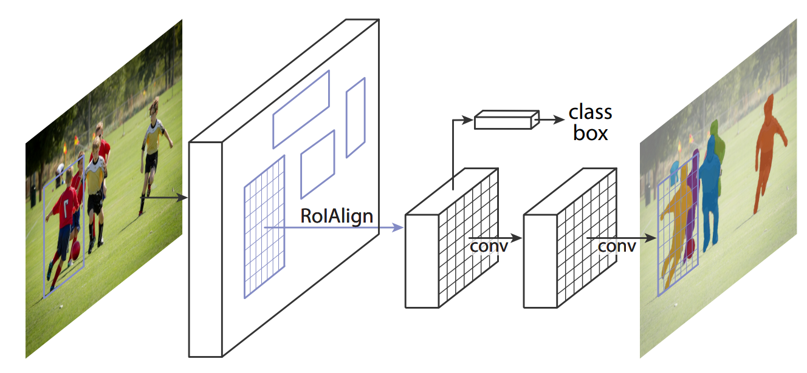
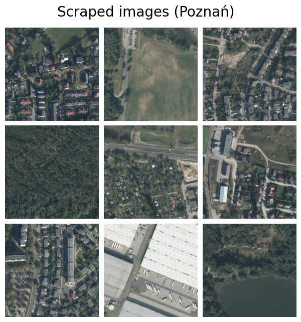
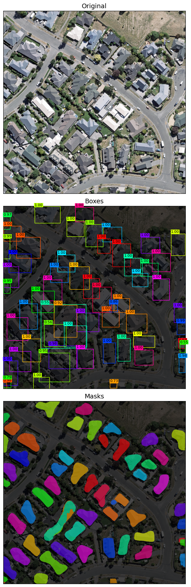

# Buildings Instance Segmentation

The goal of the instance segmentation model is to automatically detect and segment individual buildings in high-resolution aerial imagery. Unlike semantic segmentation, which labels all building pixels as a single class, instance segmentation aims to separate and delineate each building as a distinct object, even when buildings are adjacent or overlapping in dense urban areas.

## Model Architecture

**Mask R-CNN** architecture proposed here https://arxiv.org/abs/1703.06870

## Dataset

Dataset comes from two sources:

#### WHU Building Dataset (Aerial Imagery)

The main training dataset is the WHU Building Dataset, provided by the Photogrammetry and Computer Vision Group at Wuhan University. We used the aerial imagery subset, which is based on data from the New Zealand Land Information Services (LINZ).

#### Scraped Poznań Aerial Images (Geoportal Poland)

The second dataset consists of aerial images downloaded from the Polish National Geoportal.

<table>
    <tbody>
        <tr>
            <td><b>Attribute</b></td>
            <td><b>WHU-Building-Dataset</b></td>
            <td><b>Scraped Poznań images</b></td>
            <td><b>Total</b></td>
        </tr>
        <tr>
            <td>Size</td>
            <td>15 GB</td>
            <td>15 GB</td>
            <td>30 GB</td>
        </tr>
        <tr>
            <td>Source</td>
            <td>https://gpcv.whu.edu.cn/data/building_dataset.html</td>
            <td>https://www.geoportal.gov.pl/</td>
            <td></td>
        </tr>
        <tr>
            <td>Location</td>
            <td>Christchurch, New Zealand</td>
            <td>Western part of Poznań, Poland</td>
            <td></td>
        </tr>
        <tr>
            <td>Number of images</td>
            <td>5790</td>
            <td>5000</td>
            <td></td>
        </tr>
        <tr>
            <td>Image size</td>
            <td>1024 × 1024 px</td>
            <td>1024 × 1024 px</td>
            <td></td>
        </tr>
        <tr>
            <td>Spatial resolution</td>
            <td>0.3 m per pixel</td>
            <td>0.25 m per pixel</td>
            <td></td>
        </tr>
    </tbody>
</table>

<table>
    <tr>
        <td></td>
        <td></td>
    </tr>
</table>

## Traning Details

The model was trained on an NVIDIA T4 GPU for 4 epochs (approximately 4 hours) using a Kaggle notebook. Training employed a step-based learning rate scheduler with step_size = 1 and gamma = 0.5. The batch size was set to 3, with an initial learning rate of 0.005. Optimization was performed using stochastic gradient descent (SGD) with a momentum of 0.9 and a weight decay of 0.0005.

## Results

    

## References

#### Data sources

1. Ji, S., Wei, S., & Lu, M. (2018).  
   WHU Building Dataset.  
   Wuhan University.  
   https://gpcv.whu.edu.cn/data/building_dataset.html

2. Geoportal Poland.  
   https://www.geoportal.gov.pl/

#### Information sources

3. Lin, T.-Y., Goyal, P., Girshick, R., He, K., & Dollár, P. (2017).  
   Focal Loss for Dense Object Detection.  
   _arXiv preprint arXiv:1703.06870_.  
   https://arxiv.org/abs/1703.06870

4. Ronneberger, O., Fischer, P., & Brox, T. (2015).  
   U-Net: Convolutional Networks for Biomedical Image Segmentation.  
   _arXiv preprint arXiv:1506.01497_.  
   https://arxiv.org/abs/1506.01497

## Contact

✉︎ maksymiliannorkiewicz (at) gmail.com
